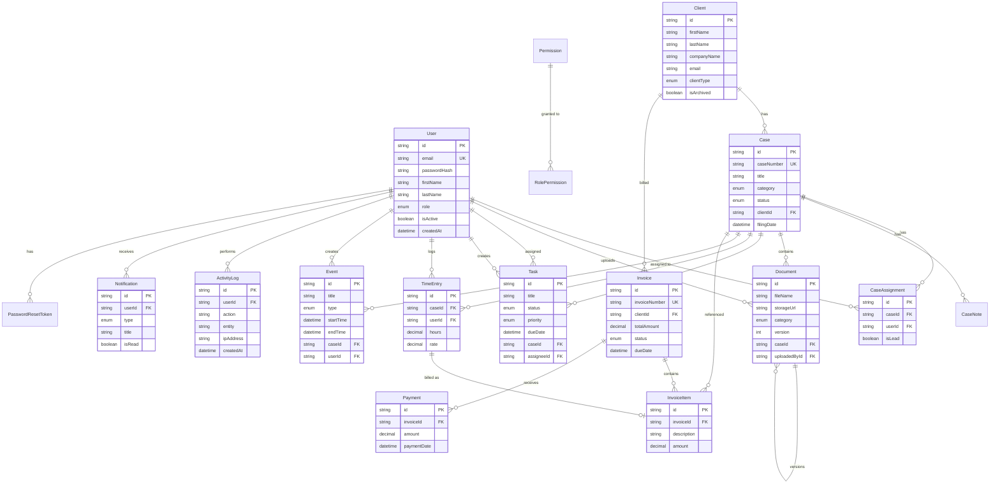

# Database Design

## Entity Relationship Diagram

## Enums

### UserRole
- SUPER_ADMIN, MANAGING_PARTNER, LAWYER, PARALEGAL, SECRETARY, ACCOUNTANT, CLIENT

### CaseStatus
- NEW, ACTIVE, PENDING, IN_COURT, SETTLED, CLOSED

### TaskStatus
- TODO, IN_PROGRESS, COMPLETED

### TaskPriority
- LOW, MEDIUM, HIGH, CRITICAL

### InvoiceStatus
- DRAFT, SENT, PAID, OVERDUE

### EventType
- HEARING, MEETING, COURT_APPEARANCE, DEADLINE, REMINDER

### DocumentCategory
- PLEADING, EVIDENCE, CORRESPONDENCE, CONTRACT, COURT_ORDER, RESEARCH, OTHER

## Indexes

Key indexes are defined on:
- User email, role
- Client email, name, archived status
- Case caseNumber, status, clientId
- Document caseId, fileName
- Task status, dueDate, assigneeId
- Event startTime, caseId
- Invoice invoiceNumber, status, clientId
- ActivityLog userId, entity, createdAt
- Notification userId + isRead
